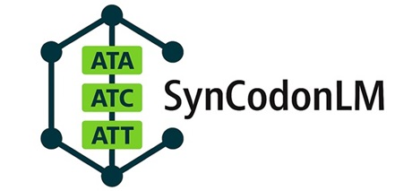

# Advancing Codon Language Modeling with Synonymous Codon Constrained Masking


- This repository contains code to utilize the model, and reproduce results of the preprint [**Advancing Codon Language Modeling with Synonymous Codon Constrained Masking**](https://www.biorxiv.org/content/10.1101/2025.08.19.671089v1), by **James Heuschkel**, **Laura Kingsley**, **Noah Pefaur**, **Andrew Nixon**, and **Steven Cramer**.
- Unlike other Codon Language Models, SynCodonLM was trained with logit-level control, masking logits for non-synonymous codons. This allowed the model to learn codon-specific patterns disentangled from protein-level semantics.
- [Pre-training dataset of 66 Million CDS is available on Hugging Face here.](https://huggingface.co/datasets/jheuschkel/cds-dataset)
---
## Installation

```python
git clone https://github.com/Boehringer-Ingelheim/SynCodonLM.git
pip install -r requirements.txt
```
---
# Usage
## Prepare Sequence

```python
from SynCodonLM.utils import clean_split_sequence
seq = 'ATGTCCACCGGGCGGTGA'
seq = clean_split_sequence(seq)  # Returns: 'ATG TCC ACC GGG CGG TGA'
```

## Load Model & Tokenizer from Hugging Face
```python
from transformers import AutoTokenizer, AutoModelForMaskedLM, AutoConfig
import torch

tokenizer = AutoTokenizer.from_pretrained("jheuschkel/SynCodonLM")
config = AutoConfig.from_pretrained("jheuschkel/SynCodonLM")
model = AutoModelForMaskedLM.from_pretrained("jheuschkel/SynCodonLM", config=config)

device = torch.device("cuda" if torch.cuda.is_available() else "cpu")
model.to(device)
```
### If there are networking issues, you can manually [download the model from Hugging Face](https://huggingface.co/jheuschkel/SynCodonLM/resolve/main/model.safetensors?download=true) & place it in the /SynCodonLM directory
```python
tokenizer = AutoTokenizer.from_pretrained("./SynCodonLM", trust_remote_code=True)
config = AutoConfig.from_pretrained("./SynCodonLM", trust_remote_code=True)
model = AutoModel.from_pretrained("./SynCodonLM", trust_remote_code=True, config=config)

device = torch.device("cuda" if torch.cuda.is_available() else "cpu")
model.to(device)

```

## Tokenize Input Sequences, Set Token Type ID Based on Species ID found in [https://github.com/Boehringer-Ingelheim/SynCodonLM/blob/master/SynCodonLM/species_token_type.py]

```python
token_type_id = 67  #E. coli
inputs = tokenizer(seq, return_tensors="pt").to(device)
inputs['token_type_ids'] = torch.full_like(inputs['input_ids'], token_type_id) # manually set token_type_ids
```

## Gather Model Outputs
```python
outputs = model(**inputs, output_hidden_states=True)
```

## Get Mean Embedding from Final Layer
```python
embedding = outputs.hidden_states[-1] #this can also index any layer (0-11)
mean_embedding = torch.mean(embedding, dim=1).squeeze(0)
```

## You Can Also View Language Head Output
```python
logits = outputs.logits  # shape: [batch_size, sequence_length, vocab_size]
```

## Citation
@article {Heuschkel2025.08.19.671089,
	author = {Heuschkel, James and Kingsley, Laura and Pefaur, Noah and Nixon, Andrew and Cramer, Steven},
	title = {Advancing Codon Language Modeling with Synonymous Codon Constrained Masking},
	elocation-id = {2025.08.19.671089},
	year = {2025},
	doi = {10.1101/2025.08.19.671089},
	publisher = {Cold Spring Harbor Laboratory},
	abstract = {Codon language models offer a promising framework for modeling protein-coding DNA sequences, yet current approaches often conflate codon usage with amino acid semantics, limiting their ability to capture DNA-level biology. We introduce SynCodonLM, a codon language model that enforces a biologically grounded constraint: masked codons are only predicted from synonymous options, guided by the known protein sequence. This design disentangles codon-level from protein-level semantics, enabling the model to learn nucleotide-specific patterns. The constraint is implemented by masking non-synonymous codons from the prediction space prior to softmax. Unlike existing models, which cluster codons by amino acid identity, SynCodonLM clusters by nucleotide properties, revealing structure aligned with DNA-level biology. Furthermore, SynCodonLM outperforms existing models on 6 of 7 benchmarks sensitive to DNA-level features, including mRNA and protein expression. Our approach advances domain-specific representation learning and opens avenues for sequence design in synthetic biology, as well as deeper insights into diverse bioprocesses.Competing Interest StatementThe authors have declared no competing interest.},
	URL = {https://www.biorxiv.org/content/early/2025/08/24/2025.08.19.671089},
	eprint = {https://www.biorxiv.org/content/early/2025/08/24/2025.08.19.671089.full.pdf},
	journal = {bioRxiv}
}


-----

## Usage With Batches
```python
from transformers import AutoTokenizer, AutoModelForMaskedLM, AutoConfig
import torch
from SynCodonLM.utils import clean_split_sequence

tokenizer = AutoTokenizer.from_pretrained("jheuschkel/SynCodonLM")
config = AutoConfig.from_pretrained("jheuschkel/SynCodonLM")
model = AutoModelForMaskedLM.from_pretrained("jheuschkel/SynCodonLM", config=config)

device = torch.device("cuda" if torch.cuda.is_available() else "cpu")
model.to(device)

# List of sequences
seqs = [
    'ATGTCCACCGGGCGGTGA',
    'ATGCGTACCGGGTAGTGA',
    'ATGTTTACCGGGTGGTGA'
]

# List of token type ids (species)
species_token_type_ids = [
    67,   # E. coli
    394,  # C. griseus
    317   # H. sapiens
]

# Prepare list
seqs = [clean_split_sequence(seq) for seq in seqs]

# Tokenize batch with padding
inputs = tokenizer(seqs, return_tensors="pt", padding=True).to(device)

# Create token_type_ids tensor
batch_size, seq_len = inputs['input_ids'].shape
token_type_ids = torch.zeros((batch_size, seq_len), dtype=torch.long).to(device)

# Fill each row with the species-specific token_type_id
for i, species_id in enumerate(species_token_type_ids):
    token_type_ids[i, :] = species_id  # Fill entire row with the species ID

# Add to inputs
inputs['token_type_ids'] = token_type_ids

# Run model
outputs = model(**inputs)
```


