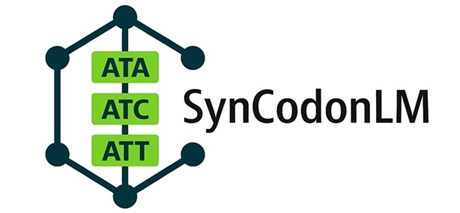

# Advancing Codon Language Modeling with Synonymous Codon Constrained Masking


- This repository contains code to utilize the model, and reproduce results of the preprint [**Advancing Codon Language Modeling with Synonymous Codon Constrained Masking**](https://doi.org/10.1101/2025.08.19.671089).
- Unlike other Codon Language Models, SynCodonLM was trained with logit-level control, masking logits for non-synonymous codons. This allowed the model to learn codon-specific patterns disentangled from protein-level semantics.
- [Pre-training dataset of 43 Million CDS is available on Hugging Face here.](https://huggingface.co/datasets/jheuschkel/clustered-cds-dataset)
---


| 🚨 **Important Update** |
|-------------------------|
| Model has been retrained — with new species token type ID numberings. Please double‑check the mapping. |


## Installation

```python
git clone https://github.com/Boehringer-Ingelheim/SynCodonLM.git
cd SynCodonLM
pip install -r requirements.txt #maybe not neccesary depending on your env :)
```
---
# Usage
#### SynCodonLM uses token-type ID's to add species-specific codon sontext to it's thinking.
###### Before use, find the token type ID (species_token_type) for your species of interest [here](https://github.com/Boehringer-Ingelheim/SynCodonLM/blob/master/SynCodonLM/species_token_type.py)!
###### Or use our list of model organisms [below](https://github.com/Boehringer-Ingelheim/SynCodonLM/tree/master#model-organisms-species-token-type-ids)
---
## Embedding a Coding DNA Sequence
```python
from SynCodonLM import CodonEmbeddings

model = CodonEmbeddings() #this loads the model & tokenizer using our built-in functions

seq = 'ATGTCCACCGGGCGGTGA'

mean_pooled_embedding = model.get_mean_embedding(seq, species_token_type=30) #E. coli
#returns --> tensor of shape [768]

raw_output = model.get_raw_embeddings(seq, species_token_type=30) #E. coli
raw_embedding_final_layer = raw_output.hidden_states[-1] #treat this like a typical Hugging Face model dictionary based output!
#returns --> tensor of shape [batch size (1), sequence length, 768]
```
## Codon Optimizing a Protein Sequence
###### This has not yet been rigourosly evaluated, although we can confidently say it will generate 'natural looking' coding-DNA sequences. 
```python
from SynCodonLM import CodonOptimizer

optimizer = CodonOptimizer() #this loads the model & tokenizer using our built-in functions

result = optimizer.optimize(
    protein_sequence="MSKGEELFTGVVPILVELDGDVNGHKFSVSGEGEGDATYGKLTLKFICTTGKLPVPWPTLVTTFSYGVQCFSRYPDHMKRHDFFKSAMPEGYVQERTIFFKDDGNYKTRAEVKFEGDTLVNRIELKGIDFKEDGNILGHKLEYNYNSHNVYIMADKQKNGIKVNFKIRHNIEDGSVQLADHYQQNTPIGDGPVLLPDNHYLSTQSALSKDPNEKRDHMVLLEFVTAAGITLGMDELYK", #GFP 
    species_token_type=30, #E. coli
    deterministic=True #true by default
)
codon_optimized_sequence = result.sequence
```

## Embedding a Coding DNA Sequence Using our Model Trained without Token Type ID
```python
from SynCodonLM import CodonEmbeddings

model = CodonEmbeddings(model_name='jheuschkel/SynCodonLM-V2-NoTokenType') #this loads the model & tokenizer using our built-in functions

seq = 'ATGTCCACCGGGCGGTGA'

mean_pooled_embedding = model.get_mean_embedding(seq)
#returns --> tensor of shape [768]

raw_output = model.get_raw_embeddings(seq)
raw_embedding_final_layer = raw_output.hidden_states[-1] #treat this like a typical Hugging Face model dictionary based output!
#returns --> tensor of shape [batch size (1), sequence length, 768]
```

## Citation
If you use this work, please cite:
```bibtex
@article {Heuschkel2025.08.19.671089,
	author = {Heuschkel, James and Kingsley, Laura and Pefaur, Noah and Nixon, Andrew and Cramer, Steven},
	title = {Advancing Codon Language Modeling with Synonymous Codon Constrained Masking},
	elocation-id = {2025.08.19.671089},
	year = {2025},
	doi = {10.1101/2025.08.19.671089},
	publisher = {Cold Spring Harbor Laboratory},
	abstract = {Codon language models offer a promising framework for modeling protein-coding DNA sequences, yet current approaches often conflate codon usage with amino acid semantics, limiting their ability to capture DNA-level biology. We introduce SynCodonLM, a codon language model that enforces a biologically grounded constraint: masked codons are only predicted from synonymous options, guided by the known protein sequence. This design disentangles codon-level from protein-level semantics, enabling the model to learn nucleotide-specific patterns. The constraint is implemented by masking non-synonymous codons from the prediction space prior to softmax. Unlike existing models, which cluster codons by amino acid identity, SynCodonLM clusters by nucleotide properties, revealing structure aligned with DNA-level biology. Furthermore, SynCodonLM outperforms existing models on 6 of 7 benchmarks sensitive to DNA-level features, including mRNA and protein expression. Our approach advances domain-specific representation learning and opens avenues for sequence design in synthetic biology, as well as deeper insights into diverse bioprocesses.Competing Interest StatementThe authors have declared no competing interest.},
	URL = {https://www.biorxiv.org/content/early/2025/08/24/2025.08.19.671089},
	eprint = {https://www.biorxiv.org/content/early/2025/08/24/2025.08.19.671089.full.pdf},
	journal = {bioRxiv}
}
```
----
#### Model Organisms Species Token Type IDs
| Organism                | Token-Type ID           |
|-------------------------|----------------|
| *E. coli*      | 30      |
| *S. cerevisiae* | 118 |
| *C. elegans*| 212  |
| *D. melanogaster*| 190 |
| *D. rerio*           |428 |
| *M. musculus*          | 368 |
| *A. thaliana*  | 258           |
| *H. sapiens*              | 373 |
| *C. griseus*               | 345 |


